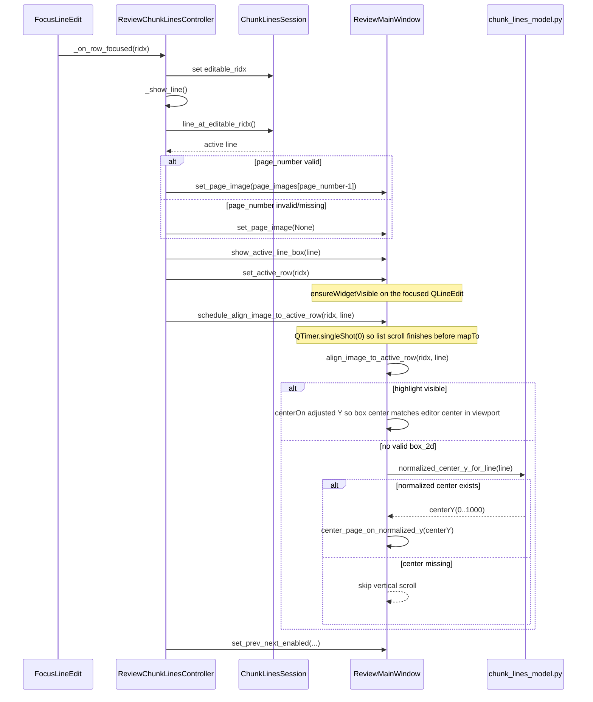

# Review Line Syncing

How transcribed lines stay aligned with the page image during review, and where to change behavior when improving accuracy.

**Code:** `prompt-based/transcribe-chunk.py`, `prompt-based/chunk_lines_model.py`, `prompt-based/review-chunk.py`

## End-to-End Sequence

```mermaid
sequenceDiagram
    participant transcribe as transcribe-chunk.py
    participant modelHelpers as chunk_lines_model.py
    participant rawJson as RawJSON(*_raw.json)
    participant reviewer as review-chunk.py
    participant session as ChunkLinesSession
    participant ui as ReviewUI(QGraphicsView)

    transcribe->>modelHelpers: load_page_images(chunkPdf, dpi=REVIEW_PDF_RASTER_DPI)
    loop for each line
        transcribe->>modelHelpers: snap_box_2d_to_ink(pageImage, box_2d)
        alt snap succeeds
            modelHelpers-->>transcribe: snapped box_2d
            transcribe->>rawJson: replace line.box_2d
        else snap weak/invalid
            modelHelpers-->>transcribe: None
            transcribe->>rawJson: keep model box_2d
        end
    end

    reviewer->>session: load_chunk(chunkName)
    session->>modelHelpers: load_payload(raw, final_if_exists)
    session->>modelHelpers: editable_line_indices(lines)
    reviewer->>ui: populate right-pane editable lines

    loop when active row changes
        reviewer->>session: line_at_editable_ridx()
        reviewer->>ui: set_page_image(pageRasterOrNone)
        reviewer->>ui: show_active_line_box(line)
        reviewer->>ui: set_active_row(ridx)
        reviewer->>ui: schedule_align_image_to_active_row(ridx, line)
        Note over ui: Deferred align maps highlight center to the active QLineEdit center in the page viewport; see Runtime UI Focus Sequence.
    end
```

## Runtime UI Focus Sequence



## Big Picture

1. **Transcription:** Optionally refine each line’s `box_2d` against the rasterized page (snap-to-ink), then write JSON.
2. **Review:** Load that JSON and PDF rasters at a fixed DPI. For the focused line, pick the page from `page_number`, draw a highlight from `box_2d`, and **scroll the image** so the highlight’s **vertical center** lines up with the **vertical center of the active line editor** in the left pane’s viewport (so the reviewer can scan mostly left–right). Extra **scene padding** above and below the page pixmap makes that possible even for lines at the bottom of the page. If there is no drawable box, the view falls back to `center_page_on_normalized_y()` using `normalized_center_y_for_line()`. There is no live OCR or text–image matching in the reviewer.

`payload['lines']` is the `lines` array in `*_final.json` or `*_raw.json`, loaded by `ChunkLinesSession.load_chunk()` → `load_payload()` in `chunk_lines_model.py`.

## Data Contract

Each line needs at least:

- `page_number` — 1-based index into the chunk PDF
- `text`
- `box_2d` — `[ymin, xmin, ymax, xmax]` on a **0–1000** grid (`BOX_2D_NORMALIZED_MAX`)

Review maps that grid to the current page pixmap size. The full box drives the highlight rectangle. **Scroll alignment** uses the **center** of that highlight (in scene coordinates) versus the **center** of the focused `QLineEdit` mapped into the page view’s viewport. **`normalized_center_y_for_line()`** (from `(ymin + ymax) / 2` on the 0–1000 grid) is used for **fallback** scrolling when `box_2d` is missing or invalid.

## Box Adjustment (snap-to-ink)

**Why:** VLM `box_2d` is a coarse layout hint (patch-based estimates can drift, merge, or skip lines). Snap-to-ink uses a **local** vertical ink profile (i.e., it counts the dark pixels across each horizontal row to mathematically find the densest "peak" of the actual text band) so review scroll/highlight tracks real text bands better. Rationale is spelled out in comments at the top of `chunk_lines_model.py`.

**What:** `snap_line_boxes_to_ink()` in `transcribe-chunk.py` calls `snap_box_2d_to_ink()` per line. On success it replaces `line['box_2d']`; on failure the model box is left unchanged. **Only vertical bounds are snapped; horizontal `xmin`/`xmax` stay as returned by the model.** Details (thresholds, peak pick, valley growth) live in `snap_box_2d_to_ink()`.

## Reviewer Behavior

`ReviewChunkLinesController._show_line()` drives page image, highlight, list focus, and scheduled alignment: `set_page_image()` → `show_active_line_box()` → `set_active_row()` (focus + `QScrollArea.ensureWidgetVisible`) → `schedule_align_image_to_active_row()`.

**Vertical sync:** `align_image_to_active_row()` keeps the current horizontal scene center, computes a vertical `centerOn` target so the active highlight’s center shares the same viewport **Y** as the active editor (using the view transform’s vertical scale). **`_update_scene_vertical_padding()`** extends `QGraphicsScene` with transparent top/bottom margin (derived from viewport height and scale) and offsets the pixmap and highlight items so the last lines can still be aligned with the transcription row. **`_refit_and_restore_focus_center()`** runs after zoom, splitter moves, and resize: it refits width, reapplies padding, then either re-runs `align_image_to_active_row()` for the last focused row (via `set_align_session()` + `_row_indices`) or `center_page_on_normalized_y()` when the last scroll used the fallback path.

Highlight padding in `show_active_line_box()` is **UI-only** and separate from crop padding in `clamp_box_2d_to_pixels()`.

### Crop padding (for `crop_for_line`, not the main review overlay)

`clamp_box_2d_to_pixels()` expands the pixel box using `CROP_PAD_*` before `Image.crop`. Diagram is schematic; actual pads depend on box size.

<svg xmlns="http://www.w3.org/2000/svg" viewBox="0 0 440 200" role="img" aria-label="Inner model box inside outer padded crop rectangle">
  <title>Crop padding: inner model box and outer expanded rectangle</title>
  <rect x="40" y="28" width="360" height="144" fill="#e0f2fe" stroke="#0369a1" stroke-width="2"/>
  <rect x="88" y="56" width="264" height="88" fill="#ffffff" stroke="#334155" stroke-width="2"/>
  <text x="220" y="22" text-anchor="middle" font-family="system-ui,Segoe UI,sans-serif" font-size="12" fill="#0369a1">Outer crop (after padding)</text>
  <text x="220" y="104" text-anchor="middle" font-family="system-ui,Segoe UI,sans-serif" font-size="11" fill="#64748b">Inner box (clamped model)</text>
  <text x="220" y="46" text-anchor="middle" font-family="system-ui,Segoe UI,sans-serif" font-size="11" fill="#0c4a6e">pad_top</text>
  <text x="220" y="158" text-anchor="middle" dominant-baseline="middle" font-family="system-ui,Segoe UI,sans-serif" font-size="11" fill="#0c4a6e">pad_bot</text>
  <text x="64" y="102" text-anchor="middle" font-family="system-ui,Segoe UI,sans-serif" font-size="11" fill="#0c4a6e" transform="rotate(-90 64 102)">pad_x</text>
  <text x="376" y="102" text-anchor="middle" font-family="system-ui,Segoe UI,sans-serif" font-size="11" fill="#0c4a6e" transform="rotate(90 376 102)">pad_x</text>
</svg>

## Failure Modes (short)

- Bad `page_number` → no page image
- Bad `box_2d` → no highlight; alignment falls back to `normalized_center_y_for_line` when possible, otherwise vertical scroll is skipped
- Snap returns `None` → original `box_2d` kept

## Tuning and Verification

- **Snap and crop:** `SNAP_*`, `CROP_PAD_*`, `REVIEW_PDF_RASTER_DPI` in `chunk_lines_model.py`
- **Review highlight:** padding in `show_active_line_box()` in `review-chunk.py`
- **Review vertical padding:** margin added in `_update_scene_vertical_padding()` in `review-chunk.py` (viewport-sized slack for bottom-line alignment)
- **Tests / visuals:** `prompt-based/tests/test_chunk_lines_model.py`, `prompt-based/tests/chunk-lines-boxes-export.py`

After changing snap logic or constants, re-run transcription for affected chunks so `*_raw.json` picks up new boxes, then spot-check in the reviewer.
