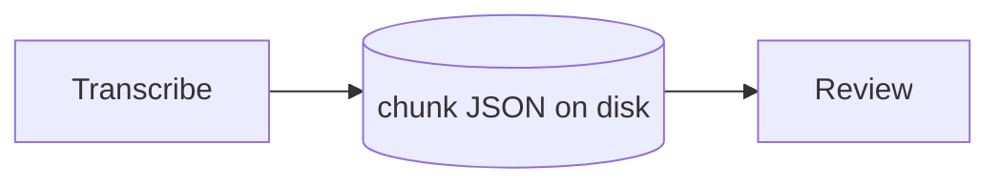
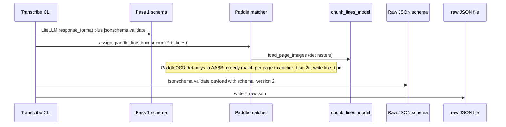
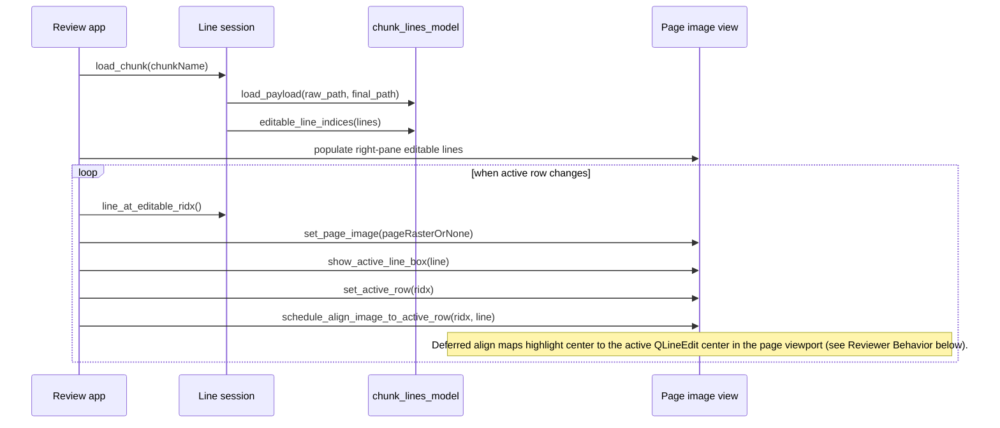

# Review Line Syncing

How transcribed lines stay aligned with the page image during review, and where to change behavior when improving accuracy.

**Code:** `prompt-based/transcribe-chunk.py`, `prompt-based/prompt_based/paddle_line_boxes.py`, `prompt-based/chunk_lines_model.py`, `prompt-based/review-chunk.py`, `prompt-based/convert-transcription-boxes.py`

## Pipeline overview

One run of **transcribe-chunk** writes (or overwrites) `*_raw.json` on disk. **review-chunk** loads that JSON (or `*_final.json` when present) and keeps the page image aligned with the focused line. The next two diagrams cover **raw transcription** on disk, then the **review UI** path from raw toward final transcription.

```mermaid
flowchart LR
  T[Transcribe] --> D[(chunk JSON on disk)]
  D --> R[Review]
```

### Raw transcription

Pass 1 is the vision model’s structured JSON (`pass-1-transcription.schema.json`). After Paddle fills `line_box`, the payload is checked against `raw-transcription.schema.json` and written as `*_raw.json`.

```mermaid
sequenceDiagram
    participant tc as Transcribe CLI
    participant p1 as Pass 1 schema
    participant pdl as Paddle matcher
    participant clm as chunk_lines_model
    participant val as Raw JSON schema
    participant out as raw JSON file

    tc->>p1: LiteLLM response_format plus jsonschema validate
    tc->>pdl: assign_paddle_line_boxes(chunkPdf, lines)
    pdl->>clm: load_page_images (det rasters)
    Note over pdl: PaddleOCR det polys to AABB, greedy match per page to anchor_box_2d, write line_box
    tc->>val: jsonschema validate payload with schema_version 2
    tc->>out: write *_raw.json
```

### Review UI: raw to final transcription

This is not a second LLM pass. The reviewer loads `*_raw.json` (and uses `*_final.json` when it already exists), lets you edit lines in the UI, and writes `*_final.json` when you save or mark review complete. Row focus drives the page image, highlight, and scroll alignment so text and image stay in sync while you work.

```mermaid
sequenceDiagram
    participant rev as Review app
    participant ses as Line session
    participant clm as chunk_lines_model
    participant pv as Page image view

    rev->>ses: load_chunk(chunkName)
    ses->>clm: load_payload(raw_path, final_path)
    ses->>clm: editable_line_indices(lines)
    rev->>pv: populate right-pane editable lines

    loop when active row changes
        rev->>ses: line_at_editable_ridx()
        rev->>pv: set_page_image(pageRasterOrNone)
        rev->>pv: show_active_line_box(line)
        rev->>pv: set_active_row(ridx)
        rev->>pv: schedule_align_image_to_active_row(ridx, line)
        Note over pv: Deferred align maps highlight center to the active QLineEdit center in the page viewport (see Reviewer Behavior below).
    end
```

## Big Picture

1. **Transcription:** Pass 1 (VLM) returns text plus coarse `anchor_box_2d` (validated with `pass-1-transcription.schema.json`). PaddleOCR detection fills **`line_box`** per line (or snap-to-ink fallback on the anchor when Paddle is missing or no detection matches). The saved `*_raw.json` is validated with `raw-transcription.schema.json` (`schema_version` 2).
2. **Review:** Load that JSON and PDF rasters at a fixed DPI. For the focused line, pick the page from `page_number`, draw a highlight from **`line_box`** (or legacy **`box_2d`**), and **scroll the page image (left pane)** so the highlight’s **vertical center** lines up with the **vertical center of the active line editor (right pane)** once that editor is mapped into the page view—so the reviewer can scan mostly **horizontally between image and transcript**. Extra **scene padding** above and below the page pixmap makes that possible even for lines at the bottom of the page. If there is no drawable box, the view falls back to `center_page_on_normalized_y()` using `normalized_center_y_for_line()`. There is no live OCR or text–image matching in the reviewer.

`payload['lines']` is the `lines` array in `*_final.json` or `*_raw.json`, loaded by `ChunkLinesSession.load_chunk()` → `load_payload()` in `chunk_lines_model.py`.

## Data Contract

On-disk **`schema_version`:** `2` at the root of `*_raw.json` / `*_final.json`.

Each line needs at least:

- `page_number` — 1-based index into the chunk PDF
- `text`
- **`line_box`** — object with integer `ymin`, `xmin`, `ymax`, `xmax` on a **0–1000** grid (`BOX_2D_NORMALIZED_MAX`)

Legacy files may still use **`box_2d`** as a four-int array; `line_aabb_four_ints()` in `chunk_lines_model.py` reads either shape.

Review maps that grid to the current page pixmap size. The full box drives the highlight rectangle. **Scroll alignment** uses the **center** of that highlight (in scene coordinates) versus the **center** of the focused `QLineEdit` mapped into the page view’s viewport. **`normalized_center_y_for_line()`** (from `(ymin + ymax) / 2` on the 0–1000 grid) is used for **fallback** scrolling when geometry is missing or invalid.

## Pass 1 vs on-disk schema

LiteLLM `response_format` uses **`pass-1-transcription.schema.json`** (lines include `anchor_box_2d`, not final `line_box`). After Paddle assignment, `transcribe-chunk.py` validates the full document with **`raw-transcription.schema.json`** before writing.

## Box geometry (PaddleOCR + matcher)

**Detection:** `paddle_line_boxes.detect_page_aabbs_px()` runs PaddleOCR with `det=True`, `rec=False` on the same rasters as review.

**Matching:** Per page, transcript lines stay in JSON order. Each line’s `anchor_box_2d` maps to the best **unused** detection by IoU in pixel space (with a nearest-center fallback when IoU is weak). This avoids pairing purely by sorted box order when the VLM omits regions Paddle still finds.

**Fallback:** If Paddle is not installed, if a page has no detections, or if no unused detection is chosen for a line, the code runs `snap_box_2d_to_ink()` on the normalized anchor. A non-`None` snap result becomes `line_box`; if snap returns `None`, `line_box` is built from the anchor’s four ints (see Failure Modes).

## Legacy migration

`convert-transcription-boxes.py` upgrades `box_2d` → `line_box` and sets `schema_version`. Optional **`--chunk-pdf`** re-runs Paddle matching for better alignment.

## Reviewer Behavior

`ReviewChunkLinesController._show_line()` drives page image, highlight, list focus, and scheduled alignment: `set_page_image()` → `show_active_line_box()` → `set_active_row()` (focus + `QScrollArea.ensureWidgetVisible`) → `schedule_align_image_to_active_row()`.

**Vertical sync:** `align_image_to_active_row()` keeps the current horizontal scene center, computes a vertical `centerOn` target so the active highlight’s center shares the same viewport **Y** as the active editor (using the view transform’s vertical scale). **`_update_scene_vertical_padding()`** extends `QGraphicsScene` with transparent top/bottom margin (derived from viewport height and scale) and offsets the pixmap and highlight items so the last lines can still be aligned with the transcription row. **`_refit_and_restore_focus_center()`** runs after zoom, splitter moves, and resize: it refits width, reapplies padding, then either re-runs `align_image_to_active_row()` for the last focused row (via `set_align_session()` + `_row_indices`) or `center_page_on_normalized_y()` when the last scroll used the fallback path.

Highlight padding in `show_active_line_box()` is **UI-only** and separate from crop padding in `clamp_box_2d_to_pixels()`.

### Crop padding (for `crop_for_line`, not the main review overlay)

`clamp_box_2d_to_pixels()` expands the pixel box using `CROP_PAD_*` before `Image.crop`. Diagram is schematic; actual pads depend on box size.

<svg xmlns="http://www.w3.org/2000/svg" viewBox="0 0 440 200" role="img" aria-label="Inner model box inside outer padded crop rectangle">
  <title>Crop padding: inner model box and outer expanded rectangle</title>
  <rect x="40" y="28" width="360" height="144" fill="#e0f2fe" stroke="#0369a1" stroke-width="2"/>
  <rect x="88" y="56" width="264" height="88" fill="#ffffff" stroke="#334155" stroke-width="2"/>
  <text x="220" y="22" text-anchor="middle" font-family="system-ui,Segoe UI,sans-serif" font-size="12" fill="#0369a1">Outer crop (after padding)</text>
  <text x="220" y="104" text-anchor="middle" font-family="system-ui,Segoe UI,sans-serif" font-size="11" fill="#64748b">Inner box (clamped model)</text>
  <text x="220" y="46" text-anchor="middle" font-family="system-ui,Segoe UI,sans-serif" font-size="11" fill="#0c4a6e">pad_top</text>
  <text x="220" y="158" text-anchor="middle" dominant-baseline="middle" font-family="system-ui,Segoe UI,sans-serif" font-size="11" fill="#0c4a6e">pad_bot</text>
  <text x="64" y="102" text-anchor="middle" font-family="system-ui,Segoe UI,sans-serif" font-size="11" fill="#0c4a6e" transform="rotate(-90 64 102)">pad_x</text>
  <text x="376" y="102" text-anchor="middle" font-family="system-ui,Segoe UI,sans-serif" font-size="11" fill="#0c4a6e" transform="rotate(90 376 102)">pad_x</text>
</svg>

## Failure Modes (short)

- Bad `page_number` → no page image
- Bad `line_box` / `box_2d` → no highlight; alignment falls back to `normalized_center_y_for_line` when possible, otherwise vertical scroll is skipped
- Snap returns `None` (no ink shrink) → `line_box` is built from the anchor’s normalized four ints (`assign_line_boxes_for_page` in `paddle_line_boxes.py`)

## Tuning and Verification

- **Snap and crop:** `SNAP_*`, `CROP_PAD_*`, `REVIEW_PDF_RASTER_DPI` in `chunk_lines_model.py`
- **Paddle match:** `IOU_MIN_CONFIDENT_MATCH` in `paddle_line_boxes.py` (tiny IoU still falls back to nearest-center pairing)
- **Review highlight:** padding in `show_active_line_box()` in `review-chunk.py`
- **Review vertical padding:** margin added in `_update_scene_vertical_padding()` in `review-chunk.py` (viewport-sized slack for bottom-line alignment)
- **Tests / visuals:** `prompt-based/tests/test_chunk_lines_model.py`, `prompt-based/tests/chunk-lines-boxes-export.py`

After changing snap logic, matcher, or crop constants, re-run transcription (or `convert-transcription-boxes.py --chunk-pdf`) for affected chunks so `*_raw.json` picks up new boxes, then spot-check in the reviewer.
